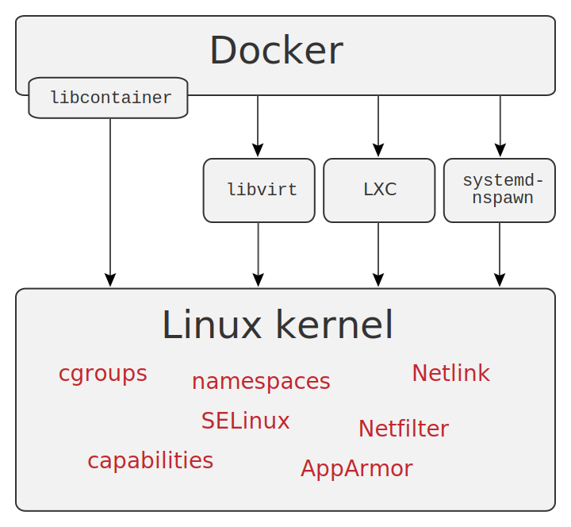

% Docker Basics
% Lukas Grossar
% September 30, 2016

# What are containers?

## Technically speaking

isolated user-space processes

a.k.a. OS-level virtualization

* Process tree isolation
* File system isolation
* Network isolation

---

## Goals of containerization

* limited scope
    * focus on one task
* self-contained
    * include all dependencies
* externally managed
    * containers have not control over resources

## OS-level virtualization

**Which solutions are available?**

* Docker
* rkt
* LXC
* Solaris Zones
* FreeBSD jail

## What's the difference to VMs?

### Containers are

* externally managed
* no changes during runtime
* persistence is optional

# Docker Basics

## Docker Installation

* Debian/Ubuntu
    * sudo apt-get install docker.io
* CentOS/Scientific Linux/RHEL
    * sudo yum install docker-engine
* Fedora
    * sudo dnf install docker-engine

[https://docs.docker.com/engine/installation/](https://docs.docker.com/engine/installation/)

## Recommendations

Use **btrfs** for **/var/lib/docker**

    /dev/vg00/docker /var/lib/docker btrfs rw 0 2

Add your user to the docker group

    sudo usermod -aG docker $USER

# First steps

## Your first commands

**Check your docker version**

    docker version

**Check the available docker options**

    docker

**Your first hello-world container**

    docker run hello-world

This pulls the image **hello-world:latest** if it isn't found locally

## Run commands in a container

**echo "hello world"**

    docker run debian echo "hello world"

**interactive shell**

    docker run -it debian bash
    # cat /etc/debian_version

# Basic Docker Commands

## Image management

Search image foo on Docker Hub

    docker search foo

Download image bar

    docker pull bar

Delete image baz locally

    docker rmi baz

## Image tags

Download image foo with tag bar

    docker pull foo:bar

Delete image foo with tag bar locally

    docker rmi foo:bar

## Container management

Start a container from the image foo

    docker run foo

Start a container in the background

    docker run -d foo

Show logs from a container

    docker logs -f $CONTAINER_ID

## Container management

Stop a running container

    docker stop $CONTAINER_ID

Kill a running container

    docker kill $CONTAINER_ID

Delete a container

    docker rm $CONTAINER_ID

## Interactive shells in containers

Run a interactive shell in a container

    docker run -it foo /bin/bash

Start a interactive shell in a running container

    docker exec -it $CONTAINER_ID /bin/bash
