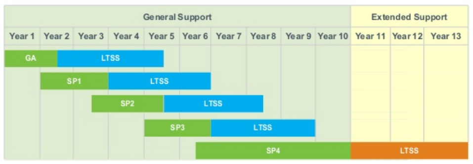
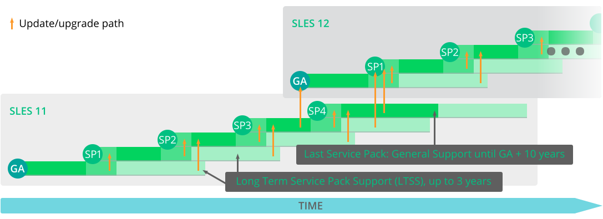

% SLES 12 SP Migration
% Marc Stulz
% November 18, 2016

# SLES 12 - SP Migration


---

## Agenda

* Overview

* Product Life Cycle

* Migration

---

## Overview

SUSE release Service Packs at regular intervals:

* Support for new hardware

* More receten versions of included packages

    * Better performance

    * Newer features

    * Bug fixes

* Product enhhancements

## Product Life Cycle



SUSE Linux Enterprise Server has a 13-year life-cycle: 10 years of general support and 3 years of extended support. 

## Upgrade Path



Major releases are made every 4 years. Service packs are made every 12-14 months. 

## Migration

* You can update from a local CD or DVD drive or from a central network installation source.

    * Network installation source:

        * SCC

        * SMT

        * SUSE Manager

        * Installation Source Server

*  graphical and a command line tool

---

## Preparations

* Backing up data

* Temporarily disable kernel multiversion support

* MySQL / PostgreSQL Database

## Disk Space

* Space requirements depend on your particular partitioning profile and the software selected. 

* During the update procedure, YaST will check the free disk space and display a warning to the user if the installation may exceed the available amount.

## Checking Disk Space

Non-Btrfs File Systems

```text
df -h
```

Btrfs Root File Systems

```text
btrfs filesystem df /

df -h /
```

## Supported Upgrade Paths

* Cross-architecture upgrades are not supported.

* SLES 10: There is no supported direct migration path to SLES 12. A fresh installation is recommended instead.

* SLES 11 GA, SP1 or SP2: There is no supported direct migration path to SLES 12. (GA -> SP1 -> SP2 -> SP3)

## Supported Upgrade Paths

* SLES 11 SP3 or SP4: Upgrading manually or migrating automatically

* SLES 12 GA: Service pack migration

---

## Upgrading Manually

* Boot from an installation source

    * Local installation medium

    * Network installation source (boot from local media or PXE)

* Select Upgrade (instead of Installation)

## Upgrading Automatically

* Copy the kernel and the initrd from the installation media

* Modify the grub `menu.lst`

* Reboot the machine

* Proceed with the usual upgrade process or add `autoupgrade=1` as kernel paramater

---

## SP Migration Online

* Supported Scenarios 

    * SCC, SMT or SUSE Manager

    * SLES 12

## Tools

* `zypper migration`

* Plain `zypper`

* `yast2 migration`

* SUSE Manager

---

## Hands-on :: SP Migrtation 10

