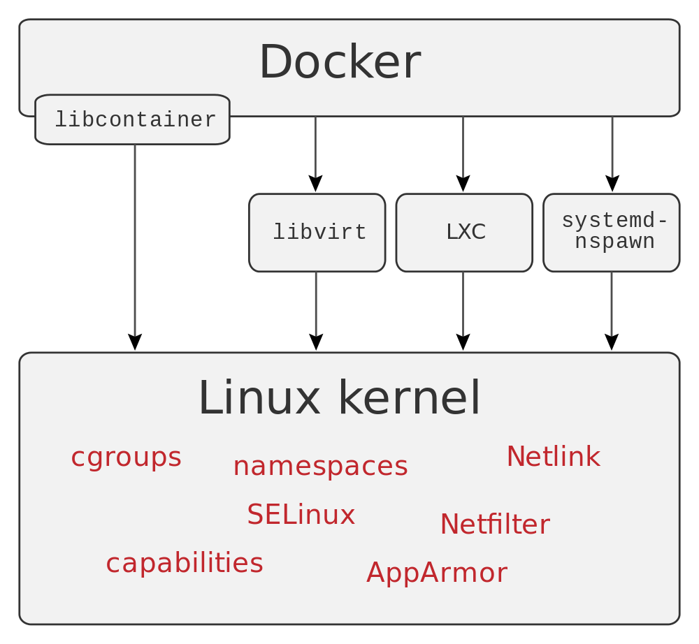

% Docker Basics
% Lukas Grossar
% September 30, 2016


Be smart. Think open source.

# What are containers?

## Technically speaking

isolated user-space processes

a.k.a. OS-level virtualization

* Process tree isolation
* File system isolation
* Network isolation

---



## Goals of containerization

## OS-level virtualization

**Which solutions are available?**

* Docker
* rkt
* LXC
* Solaris Zones
* FreeBSD jail

## What's the difference to VMs?

### Containers are

* externally managed
* no changes during runtime
* persistence is optional

# Docker Basics

## Docker Installation


[https://docs.docker.com/engine/installation/](https://docs.docker.com/engine/installation/)

## Recommendations

Use **btrfs** for **/var/lib/docker**
```
/dev/vg00/docker /var/lib/docker btrfs rw 0 2
```

Add your user to the docker group

```
sudo usermod -aG docker $USER
```

# First steps

## Your first commands

**Check your docker version**
```
docker version
```
**Check the available docker options**
```
docker
```
**Your first hello-world container**
```
docker run hello-world
```

This pulls the image **hello-world:latest** if it isn't found locally

## Run commands in a container

**echo "hello world"**
```
docker run debian echo "hello world"
```

**interactive shell**
```
docker run -it debian bash
# cat /etc/debian_version
```

# Basic Docker Commands

## Image management

Search image foo on Docker Hub
```
docker search foo
```

Download image bar
```
docker pull bar
```

List local images
```
docker images
```

Delete image baz locally
```
docker rmi baz
```

## Image tags

Download image foo with tag bar
```
docker pull foo:bar
```

Delete image foo with tag bar locally
```
docker rmi foo:bar
```

Rename/retag an image
```
docker tag example example:stable
```

## Image repositories

Download the image bar from the repository foo
```
docker pull foo/bar
```

Pull an image from the registry example.com
```
docker pull example.com/foo/bar
```

Push an image to the registry example.com
```
docker push example.com/foo/bar
```

## Container management

Start a container from the image foo
```
docker run foo
```

Start a container in the background
```
docker run -d foo
```

Show running containers
```
docker ps
```

Show logs from a container
```
docker logs -f $CONTAINER_ID
```

## Container management

Show processes running in a container
```
docker top $CONTAINER_ID
```

Stop a running container
```
docker stop $CONTAINER_ID
```

Kill a running container
```
docker kill $CONTAINER_ID
```

Delete a container
```
docker rm $CONTAINER_ID
```

## Exposed port management

Expose a container port on the host
```
docker run -p 8080:80 nginx
```

Expose all configured ports on random ports on the host
```
docker run -P nginx
```

Show exposed ports of a container
```
docker port $CONTAINER_ID
```

## Interactive shells in containers

Run a interactive shell in a container
```
docker run -it foo /bin/bash
```

Start a interactive shell in a running container
```
docker exec -it $CONTAINER_ID /bin/bash
```

# Advanced Docker commands

## Name a container

To override the automatically generated names you can specify a name on the CLI
```
docker run --name nginx_proxy nginx
```

## Delete container on exit

The option `--rm` deletes the container on exit
```
docker run --rm centos yum list installed
```

---

## Feel Free to Contact Us

[www.adfinis-sygroup.ch](https://www.adfinis-sygroup.ch)

[Tech Blog](https://www.adfinis-sygroup.ch/blog)

[GitHub](https://github.com/adfinis-sygroup)

<info@adfinis-sygroup.ch>

[Twitter](https://twitter.com/adfinissygroup)
