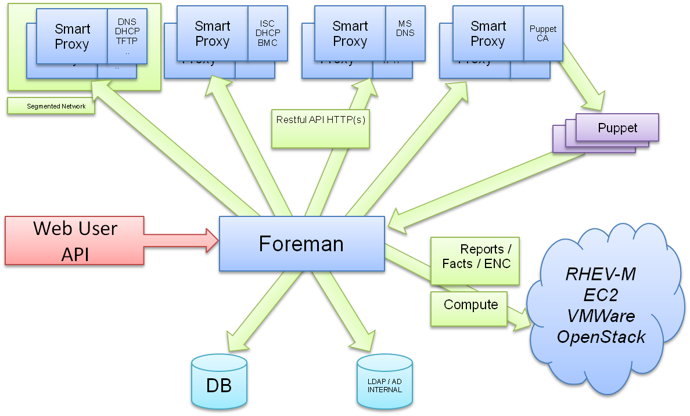

% Foreman Basics
% Andrea Bettich & Michael Hofer
% June 12, 2017


Be smart. Think open source.

# Foreman - Basics

Lifecycle management of physical and virtual machines made easy!


---

## Agenda

* Introduction to Foreman

* Architecture

* Setup

* Provisioning

* Configuration

* Monitoring

* Advanced features

---

## Introduction to Foreman

What's it all about?

## Facts

* Project started in 2009

* Licensed under the GPLv3

* Development pushed by Red Hat

* Very active & helpful community

## Overview

* Tool for provisioning of VMs & bare metal

* Provides config management & monitoring integration

* Rails & JavaScript application

* Exposes a web interface, REST API & CLI

## Ecosystem

* Foreman

* Smart Proxy (foreman-proxy)

* Katello

* Tons of plugins

## Strong suite

* Very flexible

* Offers tons of features

* Active development & open community

* Modular setup, start small then expand

## Strong suite

* Can serve as a source of truth (CMDB)

* Can be used as an ENC

* Proper ACL implementation

* Enterprise Support available (Red Hat Satellite 6)

## Weak spots

* Somewhat steep learning curve

* Can be quite tricky to debug an issue

* API has room for improvement

* Offers sometimes too many possible ways to implement a task

---

## Architecture

Overview of the different components

## Bird's-eye view



## Foreman

* Heart of the whole stack

* Stores all resources & information

* Rails stack, use Passenger + nginx / Apache to run it

* Stores most data in a DB (SQLite, MySQL or PostgreSQL)

* Local or LDAP users for authentication

## Smart Proxy

* Small autonomous HTTP application

* Exposes a REST API to provide different services

* Allows Foreman to control components in isolated networks

* Also called foreman-proxy

## Smart Proxy

* DHCP

* DNS

* TFTP

* BMC / IPMI

* Puppet / Salt / Chef / Ansible

* Realm / FreeIPA

## Smart Proxy - DHCP

* Takes care of reserving the required IPs

* Provides IP auto-assignment

* Supports ISC DHCP, MS DHCP & libvirt

* More providers can be installed or developed (e.g. InfoBlox)

## Smart Proxy - DNS

* Update and remove DNS records automatically

* Takes care of A, AAAA & PTR records

* Supports Bind, MS DNS & libvirt

* More providers can be installed or developed (e.g. AWS53)

## Smart Proxy - TFTP

* Provide images during PXE boot

* Automagically downloads kernel + initrd (installer)

* Prepares MAC specific config depending on the build state

* Fallback to `default`

## Terminology

* Host

* Installation media

* Partition tables

* Provisioning templates

## Terminology

* Environment

* Compute resources

* Compute profiles

---

## Hands-on :: Basics 01

Discover the basics of Foreman

---

## Foreman Setup

Get Foreman up and running in minutes

## Requirements

Supported distributions:

* RHEL 7, CentOS 7 & Scientific Linux 7

* Fedora 24

* Debian 8

* Ubuntu 14.04 & 16.04

## Requirements

* Standard VM is sufficient for the start

* Additional repositories depending on the distribution

* Internet access

* Firewall ports

## Installation paths

* foreman-installer (recommended by the project)

* Install from package

* Install from source

* Alternatives ([Ansible playbook](https://github.com/adfinis-sygroup/foreman-ansible), etc.)

## foreman-installer

Makes use of different Puppet modules to deploy a complete Foreman stack:

* Foreman

* Smart proxy

* Passenger

* TFTP, DNS & DHCP

## foreman-installer

* Customizable with CLI parameters

* Answers file

* Scenarios

---

## Provisioning

Making deployments as easy as pie


---

## Introduction

* Provisioning includes all the tasks required to setup a new machine

* Saving time isn't the main goal

* Enforce consistency across all deployments is key


## Workflow

1. Boot the installer

2. Start the installation

3. Get further instructions from Foreman

## Boot the installer

* PXE Boot (TFTP provided by Foreman)

* ISO image

* iPXE image

## Start the installation

* Tell the installer where further instructions are located

* Red Hat Kickstart
```
ks=http://foreman.example.com/unattended/provision
```

* Debian Preseed
```
url=http://foreman.example.com/unattended/provision
```

* Defined as kernel parameters when loading the installer

## Installer instructions

* Foreman provides templating functionality

* ERB templates are rendered per host

* Contain variables, loops, snippets, etc.

* See `provisioning templates` & `partition tables`

## Templates

* Foreman provides [community templates](https://github.com/theforeman/community-templates)

* Vanilla templates are locked by default

* Can be deleted but some are mandatory (e.g. `PXELinux global default`)

## Templates

* Partition tables are used to define the filesystem layout

Different provisioning template types are available:

* Provisioning

* Finish

* etc.

## Requirements

For a complete provisioning workflow we need some resources:

* Architecture

* Installation media (mirror)

* OS

* Templates

## Example

* x86_64

* http://mirror.centos.org/centos/\$version/os/\$arch

* CentOS 7

* Default FS Layout, Kickstart & Finish script

---

## Hands-on :: Basics 02

Automating OS deployments is hard you've said?

---

## Configuration

Bring order into your organization


---

## Structure

Foreman provides different resources to organize hosts:

* Hostgroup

* Domains

* Environments

* Organizations & Locations

## Structure

Parameter inheritance looks like this:
```
Environment
  -> Domains
       -> Hostgroup
            -> Host
```

## Config Management

„Define how a system should look like in an abstract way.“

## Integration

* Foreman provides ENC functionality

* Supports mainly Puppet but extendable with plugins

## Ansible

* Ansible plugin is still the new face in town

* Ansible provides dynamic Foreman inventory script 

* Roles can be assigned to hosts and hostgroups

* Play roles through the GUI

* Import and delete roles through the GUI

---

## Hands-on :: Basics 03

Looking into the Ansible integration

---

## Monitoring

Collect and aggregate everything


## Facts

* Foreman saves facts for each host

* Collect facts regularly and store them in Foreman

* Leverage them again in your Config Management Tool

## Reports

* Collect and track config changes

* Mainly supported for Puppet / Salt

## More data

* Audit log keeps track of all changes, very handy

* Trends give an overview of your infrastructure

---

## Advanced features

Adding even more fancy stuff

---

## Plugins

* Cloud providers (Azure, Digitalocean, etc.)

* Docker

* VMWare & libvirt

* Katello

* OpenSCAP

## Foreman Automation

* Foreman provides REST API

* Can be easily used to automate additional tasks

* Hammer is a CLI tool

* Somewhat limited because internal IDs have to be looked up first

* Other tools ([foreman-yml](https://github.com/adfinis-sygroup/foreman-yml), etc.)

---

## Field report

What have you learned?

* Architecture                                                                  
                                                                                
* Setup                                                                         
                                                                                
* Provisioning                                                                  
                                                                                
* Configuration                                                                 
                                                                                
* Monitoring                                                                    
                                                                                
* Advanced features                                                             

---

## Quo vadis?

* Foreman Automation

* External services (password stores, CMDB, etc.)

* Development Workflow (CI & CT)

## Feedback

The good, the bad and the ugly

---

## Thank you!

Be smart. Think open source.


---

## Feel Free to Contact Us

[www.adfinis-sygroup.ch](https://www.adfinis-sygroup.ch)

[Tech Blog](https://www.adfinis-sygroup.ch/blog)

[GitHub](https://github.com/adfinis-sygroup)

<info@adfinis-sygroup.ch>

[Twitter](https://twitter.com/adfinissygroup)

---

## Attribution / License

* The Foreman logo by The Foreman project
  License CC BY-SA 3.0 https://github.com/theforeman/foreman-graphics

* Foreman Architecture by The Foreman project
  License CC BY-SA 3.0 https://theforeman.org/static/images/foreman_architecture.png

* Foreman Provisioning by The Foreman project
  License CC BY-SA 3.0 https://theforeman.org/static/images/provisioning.png

## Attribution / License

* Foreman Configuration by The Foreman project
  License CC BY-SA 3.0 https://theforeman.org/static/images/configuration.png

* Foreman Monitoring by The Foreman project
  License CC BY-SA 3.0 https://theforeman.org/static/images/monitoring.png

* XKCD - The General Problem by xkcd https://xkcd.com/974/
  License CC-BY-NC https://xkcd.com/license.html
