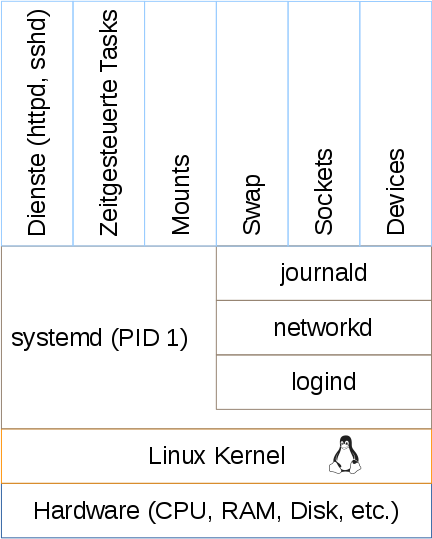

# Modul „systemd“ [SSA 1001]

---

## systemd Daemon 1/2

* PID 1, wird vom Kernel gestartet

* Verwaltet (auch) System Daemons

* Initialisiert das System (mounts, loging Infrastruktur, Netzwerk, ...)

* Ersetzt **SystemV init** (/etc/init.d/…)

---

## systemd Daemon 2/2

* Parallelisierte Abarbeitung

* Löst Abhängigkeiten selber auf

* Beendet Daemons richtig



---

## Units: Dienste, Devices, Sockets, ...

* systemd verwaltet nicht nur Dienste

* Von systemd verwaltete Elemente werden als Units bezeichnet

* Units werden durch INI-Style Files definiert

* Units sind z.B.

  * Daemons (systemV /etc/init.d/...)

  * Mounts (systemV /etc/fstab)

  * Verzeichnisse

  * Periodische Aufgaben (systemV Cron)

---

## Units

* INI-Style Files mit denen Dienste, Mounts, etc. konfiguriert werden

* man 5 systemd.unit

* /usr/lib/systemd/system (Distro) oder /etc/systemd/system (Admin), /etc hat Vorrang

---

## Beispiel Unit-File (timer)

```
[Unit]
Description=Daily Cleanup of Temporary Directories
Documentation=man:tmpfiles.d(5) man:systemd-tmpfiles(8)

[Timer]
OnBootSec=15min
OnUnitActiveSec=1d
```

---

## Beispiel Unit-File (mount)

```
[Unit]
Description=Temporary Directory
Documentation=man:hier(7)
Documentation=http://www.freedesktop.org/wiki/Software/systemd/APIFileSystems
ConditionPathIsSymbolicLink=!/tmp
DefaultDependencies=no
Conflicts=umount.target
Before=local-fs.target umount.target
After=swap.target

[Mount]
What=tmpfs
Where=/tmp
Type=tmpfs
Options=mode=1777,strictatime,nosuid,nodev
```

---

## Beispiel Unit-File (socket)

```
[Unit]
Description=Docker Socket for the API
PartOf=docker.service

[Socket]
ListenStream=/var/run/docker.sock
SocketMode=0660
SocketUser=root
SocketGroup=docker

[Install]
WantedBy=sockets.target
```

# Die wichtigsten Befehle

---

## systemctl 1/3

* Äquivalent zu service
```shell
systemctl start $name.service
systemctl stop $name.service
systemctl reload $name.service
systemctl restart $name.service
systemctl status $name.service
```

* Wenn kein Unit-Typ angegeben ist, wird .service verwendet.

* man 1 systemctl

---

## systemctl 2/3

* Äquivalent zu chkconfig und update-rc.d
```shell
systemctl enable $name.service
systemctl disable $name.service
```

---

## systemctl 3/3

* Status eines Services prüfen
```shell
systemctl status $name.service
```

* Geladene Services auflisten
```shell
systemctl -t service
```

* Alle installierten Services auflisten
```shell
systemctl list-unit-files -t service
```

* Status auflisten
```shell
systemctl --state failed
```

---

# systemd Targets

---

## Targets 1/3
* Targets sind vergleichbar mit Runlevels

* Standard target auslesen
```shell
systemctl get-default
```

* Standard target setzen
```shell
systemctl set-default $target
```

* Zur Laufzeit ändern
```shell
systemctl isolate $target
```

* Targets auflisten
```shell
systemctl -t target
```

---

## Targets 2/3

Targets sind in /usr/lib/systemd/system definiert

```
[Unit]
Description=Graphical Interface
Documentation=man:systemd.special(7)
Requires=multi-user.target
Wants=display-manager.service
Conflicts=rescue.service rescue.target
After=multi-user.target rescue.service [...]
AllowIsolate=yes
```

## Targets 3/3

* Target als Kernel-Param. definieren

  * systemd.unit=[target]
  * single, s, S oder 1 werden auch unterstützt
  * emergency ähnlich zu init=/bin/bash

* Debug als Kernel-Param. definieren

  * debug
  * debug systemd.log_target=kmsg log_buf_len=1M
  * debug systemd.log_target=console console=ttyS0

---

# systemd Service

---

## Service Units 1/4

* Eigenschaften eines Units anzeigen
```shell
systemctl show $name
```

* Spezifische Eigenschaft anzeigen
```shell
systemctl show -p Restart $name
```

* Referenzen
```shell
man systemd.exec
man systemd.service
man systemd.kill
```

---

## Service Units 2/4

* Erweiterte Settings

User	= Unix User mit dem der Dienst gestartet wird

Group	= Unix Gruppe mit dem der Dienst gestartet wird

CapabilityBoundingSet	= Aktiviere Capabilities

ProtectSystem	= Einschränkung der Schreibrechte

SystemCallFilter	= Einschränkung der Syscalls

PrivateTmp 						 	= Eigenes /tmp und /var/tmp

PrivateDevices	= Eigenes /dev ohne z.B. sda

ProtectHome						 	= /home, /root, /run/users geschützt

---

## Service Units 4/4

* Drop-Ins ergänzen Unit Files um spezifische Settings

* Beispiel:

```shell
mkdir /etc/systemd/system/httpd.service.d
vim /etc/systemd/system/httpd.service.d/50-httpd.conf
```

```
[Service]
OOMScoreAdjust=-1000
```

```shell
systemctl daemon-reload
systemctl status httpd
```

---

## Sicherheit + Stabilität

* Die Einschränkungen von Schreibrechten, Capabilities und Devices ist ein grosser Vorteil von systemd gegenüber SystemV init

* Durch die Einschränkung von Syscalls können auch sehr spezifische Angriffe abgefangen werden

* systemd kann zudem die zugesprochene CPU-Time, die Anzahl offener File Handels und viele weitere Ressourcen-Typen kontrollieren und einschränken

---

# systemd Timer

---

## Timer Units 1/3

* Mit systemd Timer können Cron ähnliche Tasks implementiert werden

* Vielseitige Möglichkeiten, den Intervall zu definieren

* man 5 systemd.timer

---

## Timer Units 2/3

* Timer bestehen aus einem .timer Unit und einem .service Unit

* Alternativ kann man mit systemd-run auch temporäre Tasks ohne .timer Unit erstellen
```shell
systemd-run --on-active="1min" /opt/logger.sh
```

* Timer auflisten / löschen
```shell
systemctl list-timers –all
systemctl stop $name
```

---

## Timer Units 3/3

* MAILTO Funktionalität von cron muss separat umgesetzt werden
siehe z.B:
https://wiki.archlinux.org/index.php/Systemd/Timers#MAILTO

---

## Attribution / License

* Tux Logo
By gg3po, Iwan Gabovitch - Tux Mono SVG, based on File:NewTux.svg by gg3po which is based on File:Tux.png byLarry Ewing, GPL, https://commons.wikimedia.org/w/index.php?curid=48629266

* Slides
Adfinis SyGroup AG, 2016, Attribution-NonCommercial 2.0
(CC BY-NC 2.0)
