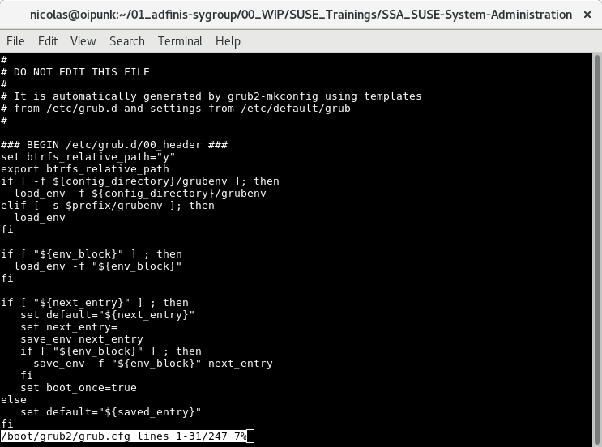
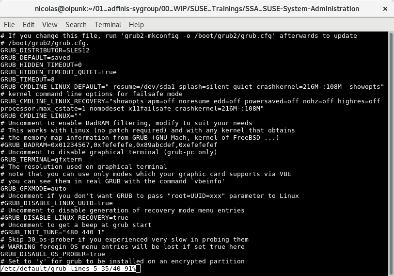
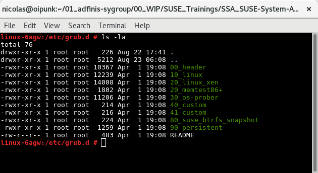
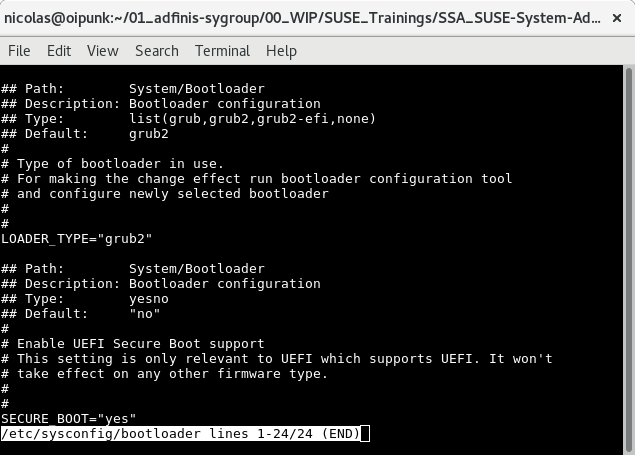
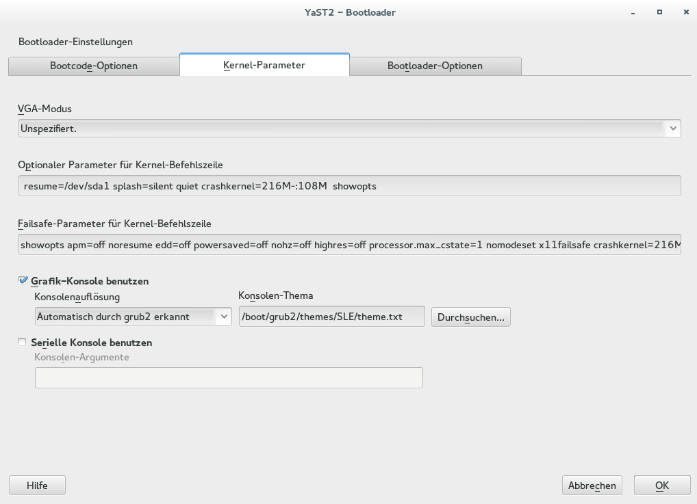
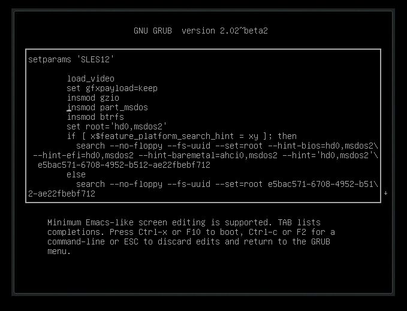

# Modul "GRUB 2" [SSA 1004]

# Unterschiede zwischen GRUB Legacy und GRUB 2

* Struktur der Konfigurationsdateien

* Mehr Filesysteme werden unterstützt (z.B. btrfs)

* LVM oder RAID können direkt gelesen werden

* Zusatzmodule können geladen werden

* Automatische Konfiguration von anderen Kerneln und Betriebssystemen

* Minimale Konsole integriert

# GRUB 2 Konfiguration

* Konfiguration wird mit grub2-mkconfig generiert

* Konfiguration via /etc/default/grub

* Skripte in /etc/grub.d generieren die Konfiguration

* /boot/grub2/grub.cfg wird beim Booten geladen

  * ersetzt menu.lst in GRUB Legacy

# /boot/grub2/grub.cfg

* Ersetzt menu.lst

* Wird durch grub2-mkconfig generiert

# /boot/grub2/grub.cfg



# /etc/default/grub 1/3

Variablen zur Kontrolle des GRUB 2 Menüs

* GRUB_DEFAULT
  * Welches Menü Item wird standardmässig gestartet


* GRUB_TIMEOUT
  * Menü wird x Sekunden gezeigt, bevor GRUB_DEFAULT gestartet wird


* GRUB_HIDDEN_TIMEOUT
  * Es wird x Sekunden ohne Menü gewartet, bevor GRUB_DEFAULT gestartet wird


* GRUB_HIDDEN_TIMEOUT_QUIET
  * Wie oben, aber ein Countdown wird angezeigt

# /etc/default/grub 2/3

Variablen zur Kontrolle der Kernel Parameter

* GRUB_CMDLINE_LINUX
  * Globale Kernel Parameter


* GRUB_CMDLINE_LINUX_DEFAULT
  * Extra Kernel Parameter für normalen Boot


* GRUB_CMDLINE_LINUX_RECOVERY
  * Extra Kernel Parameter für Recovery Boot

# /etc/default/grub 3/3

Variablen zur Kontrolle des Aussehens

* GRUB_BACKGROUND
  * Pfad zu einem PNG


* GRUB_THEME
  * Pfad zu einem Grub Theme File

# /etc/default/grub



# /etc/grub.d 1/3

* Die Scripte in /etc/grub.d werden beim Ausführen von grub2-mkconfig aufgerufen

* Die Scripts modifizieren /boot/grub/grub.cfg

* Konventionen
  * 00_* reserviert für 00_header
  * 10_* Boot-Einträge
  * 20_* 3rd party Apps wie z.B. memtest86+

# /etc/grub.d 2/3

* 00_header

  Setzt Umgebungsvariablen wie Display settings & Theme und übernimmt die Werte aus /etc/default/grub

* 10_linux

  Erkennt Linux Kernel auf der root-Partition und erstellt entsprechende Einträge

* 30_prober

  Nutzt das Tool os-prober um andere OS zu finden und dafür die entsprechenden Einträge zu erstellen

# /etc/grub.d 3/3

* 40_custom

  Hier können zusätzliche Einträge direkt eingetragen werden

* 90_persistent

  Kopiert den spezifisch markierten Abschnitt in /boot/grub/grub.cfg vor dem Ausführen von grub2-mkconfig und fügt ihn im neuen File wieder ein

# /etc/grub.d



# Ein manueller eingetragen

```
menuentry 'AdSy Test' {
        set	root='hd0,msdos2'

        echo	'Loading AdSy Test \o/'
        linux	/boot/vmlinuz-3.12.60-52.54-default root=UUID=e5[...]f12 ${extra_cmdline}
        echo	'Loading initial ramdisk \o/'
        initrd	/boot/initrd-3.12.60-52.54-default
}
```

# /etc/sysconfig/bootloader

* SUSE spezifisch

* Wird verwendet, wenn ein neuer Kernel installiert oder der Bootloader via YAST konfiguriert wird

* Wird durch das Tool perl-bootloader ausgelesen – die Parameter werden in /boot/grub/grub2.cfg übertragen

# /etc/sysconfig/Bootloader



# Architektur spezifische Details

* Architektur spezifische Angabe sind in den folgenden Files definiert:

  * /boot/grub2/x86_64-efi

  * /boot/grub2/power-ieee1275

  * /boot/grub2/s390x

# SUSE GRUB 2 Konfiguration

* Spezielle SUSE Variablen in /etc/default/grub

* SUSE_BTRFS_SNAPSHOT_BOOTING

  * Boot von Snapper Snapshots aktivieren

# device.map

* device.map mappt BIOS Laufwerke auf Linux Laufwerke

* Bei GRUB 2 ist dieses File nicht mehr statisch

* Das File wird on-the-fly generiert

* Falls das mapping manuell angepasst werden muss, erstellt man dafür das File /boot/grub2/device.map

* Beispiel Eintrag:

  (hd0)  /dev/sda

# Konfiguration mit YAST

* Die Konfiguration kann auch mit YAST durchgeführt werden

* Das Modul findet man unter

  System > Bootloader

# YAST Ansicht



# Neuer Kernel in der Liste aufnehmen

* Wenn ein neuer Kernel installiert wird, ist es ausreichend, grub2-mkconfig auszuführen

* Das Script /etc/grub.d/10_linux wird den neuen Kernel finden ud die nötigen Einträge erstellen

* grub2-mkconfig wird bei der Paket-Installation automatisch aufgerufen

# Eintrag beim Booten anpassen

* GRUB 2 bietet ebenfalls einen Edit-Modus beim Booten

* Über die Taste E kann ein Eintrag editiert werden

* Mit den Pfeiltasten können in den Zeilen navigiert werden

* Eintrag booten CTRL + X oder F10

* GRUB Shell CTRL + C oder F12

# Eintrag editieren



# Wichtigste Commands

* Neue /boot/grub.cfg generieren

```
grub2-mkconfig -o /boot/grub2/grub.cfg
```
* Syntax Check

```
grub2-script-check
```
* Default Kernel für den nächsten Boot (einmalig) setzen

```
grub2-once $id
```

# Attribution / License

* Slides

  Adfinis SyGroup AG, 2016, Attribution-NonCommercial 2.0 (CC BY-NC 2.0)
