Be smart. Think open source.

# Demo zu Module "grub2" [SSA 1004]

# Konfiguration editieren und grub.cfg neu generieren

# Config ändern, grub.cfg neu generieren

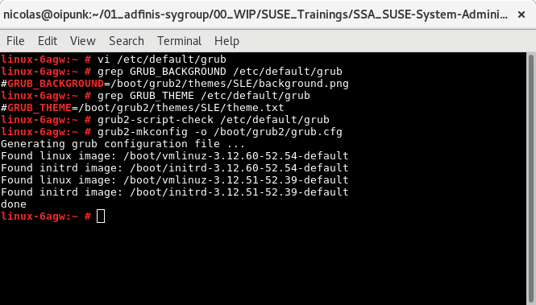

# Neu booten

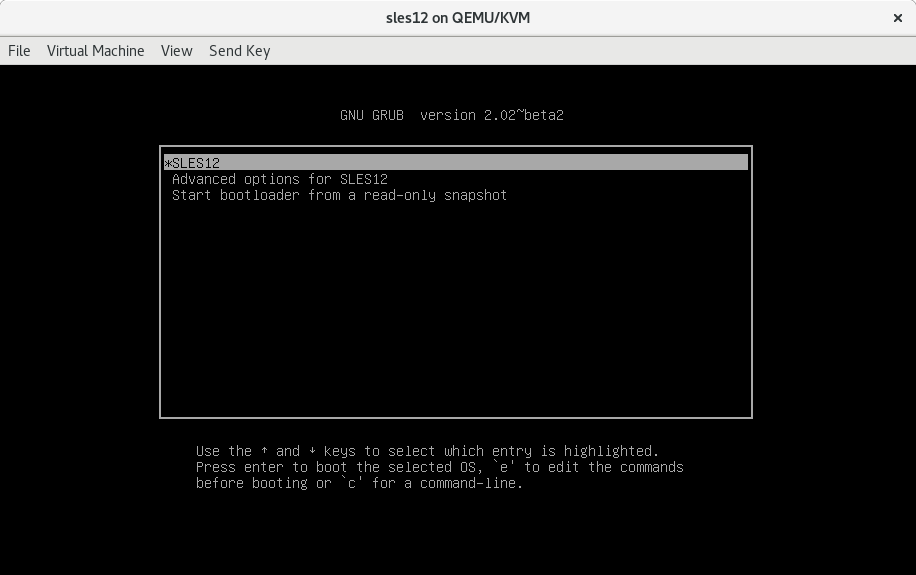

# Für den nächsten Reboot einen anderen Kernel wählen

# Liste der Kernel anzeigen und temporären Kernel wählen

# GRUB 2 Passwort setzen

# Passwort generieren und in 40_custom ablegen

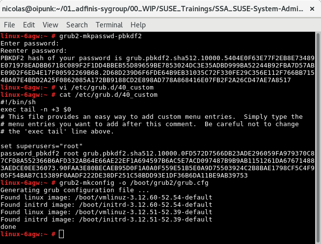

# Passwort Abfrage während des Bootens

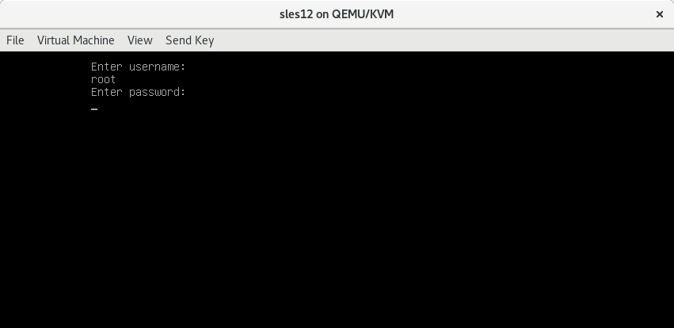

# System im  Single User Mode starten

# Eintrag editieren

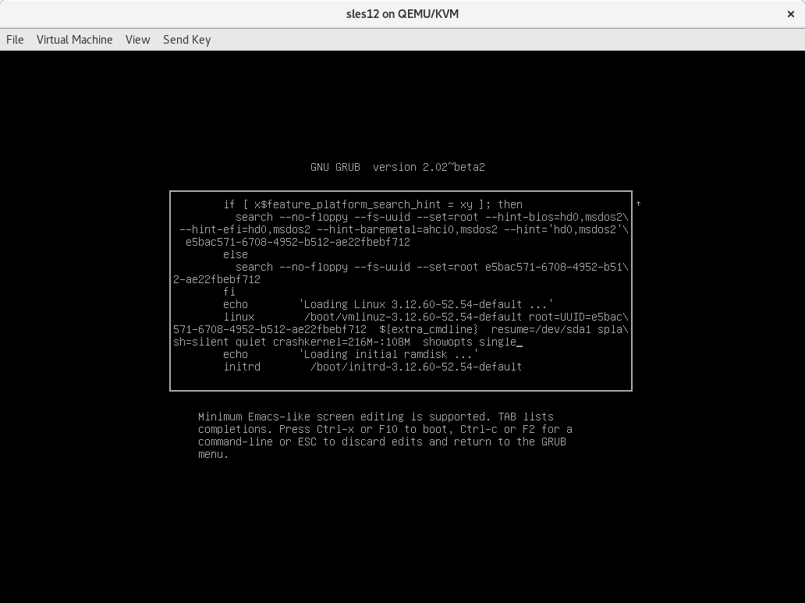

# Minimale Shell (Single User Mode)

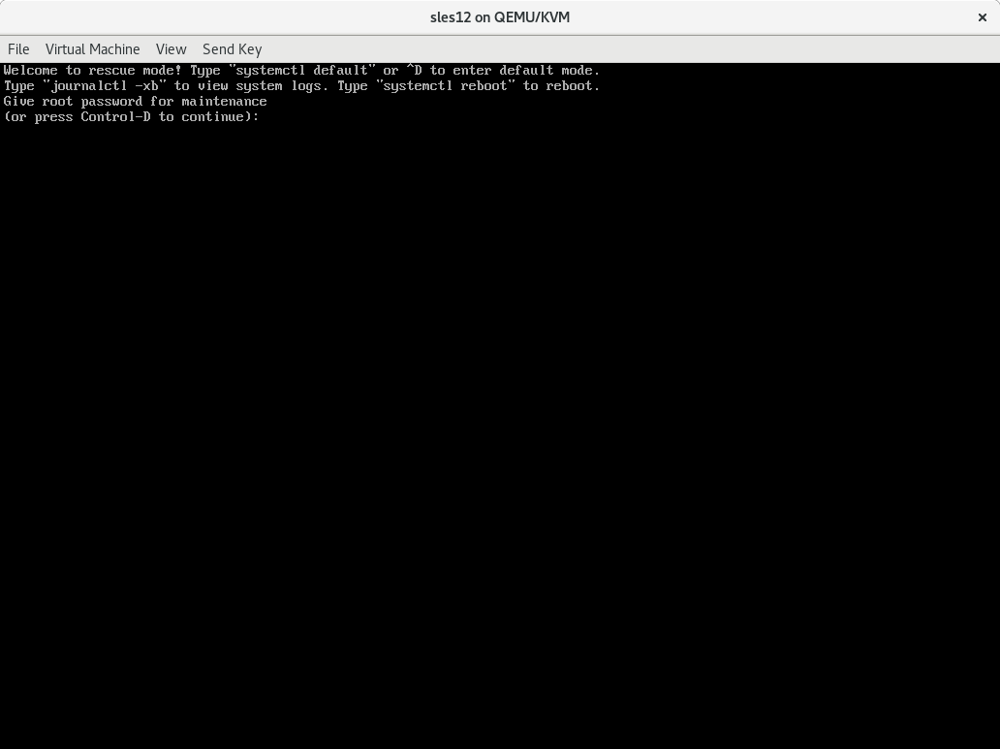

# Manuell neuen Boot Eintrag erstellen

# /etc/grub.d/40_custom editieren

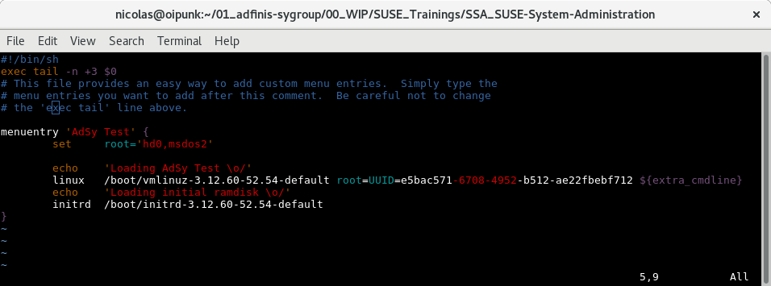

# GRUB Config neu generieren

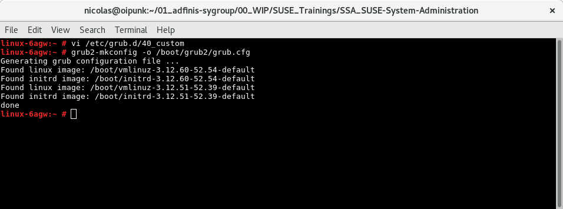

# System neu booten

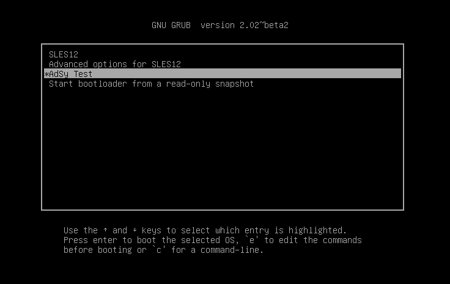

# Weiteren Kernel installieren und GRUB Boot Menü aktualisieren lassen

# Eine spezifische Kernel Version suchen

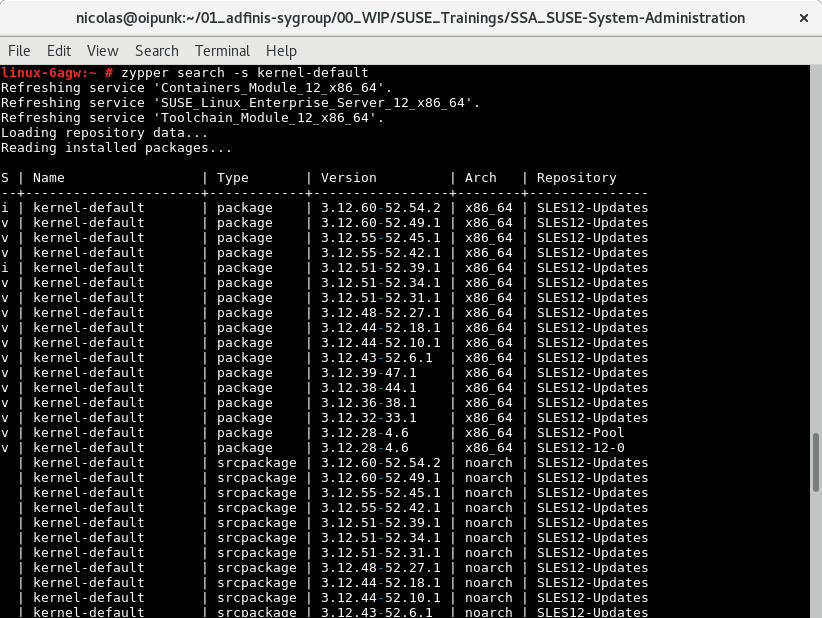

# Spezifischen Kernel installieren

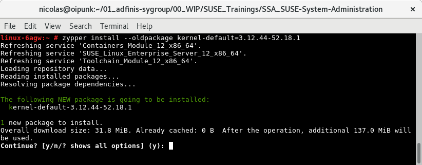

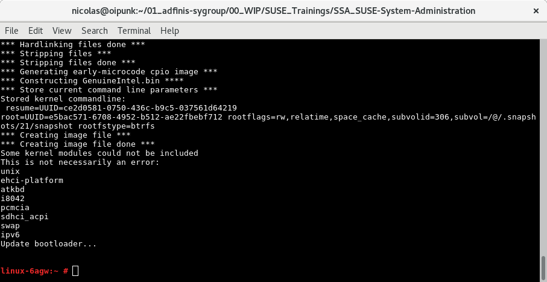

# GRUB Menü Anpassung prüfen

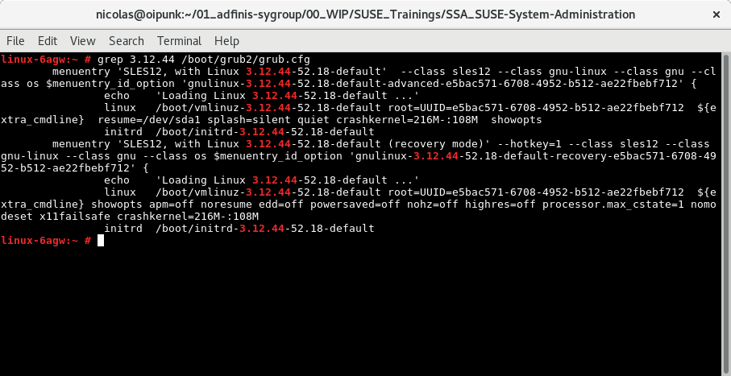

# Attribution / License

* Slides

  Adfinis SyGroup AG, 2016, Attribution-NonCommercial 2.0 (CC BY-NC 2.0)

---

## Feel Free to Contact Us

[www.adfinis-sygroup.ch](https://www.adfinis-sygroup.ch)

[Tech Blog](https://www.adfinis-sygroup.ch/blog)

[GitHub](https://github.com/adfinis-sygroup)

<info@adfinis-sygroup.ch>

[Twitter](https://twitter.com/adfinissygroup)
